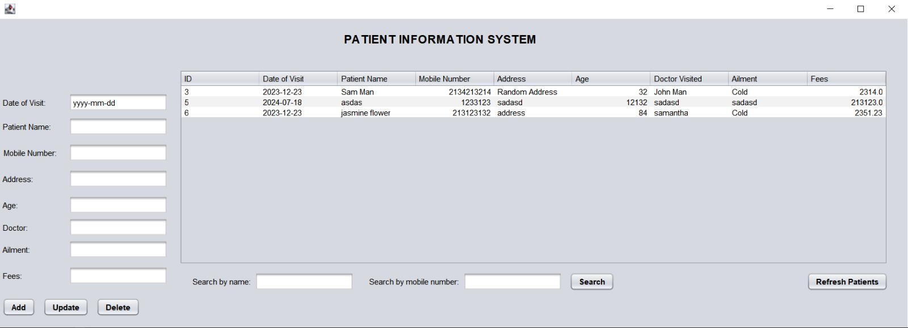

# hospital-management-application
A table of patients where you can add, update, and delete. You can also search by name and mobile number

# Running the Program
- download zip of all code
- disable Windows Defender Real-Time protection so that setup.exe doesn't get deleted automatically after download
- setup > setup.exe
    - after running setup.exe, follow instructions to launch hospital program
- Re-enable Windows Defender Real-Time protection

## Architecture
- Java JFrame form built with NetBeans IDE
- Embedded H2 Database

### Helpful Videos:

Video which helped me configure an embedded h2 database:https://www.youtube.com/watch?v=nanfpfO5d2A
    - Part 2 with deployment to .exe file: https://www.youtube.com/watch?v=sOpmmrG-csM&t=66s

Series which helped me code the table functionalities: https://www.youtube.com/watch?v=pMTob1xWvD0

### 12/21/2023
- Created executable file with launch4j and Inno Setup Compiler
- Needed to compile the project in JDK 11 and download JRE11 from (https://adoptium.net/temurin/releases/?version=11) in order to successfully create and run the executable file
- Needed to deactivate Windows Defender Real-Time protection to run the setup.exe
    - don't need to do this to run the hospital file itself

# Hospital Program Versions:

### V1
